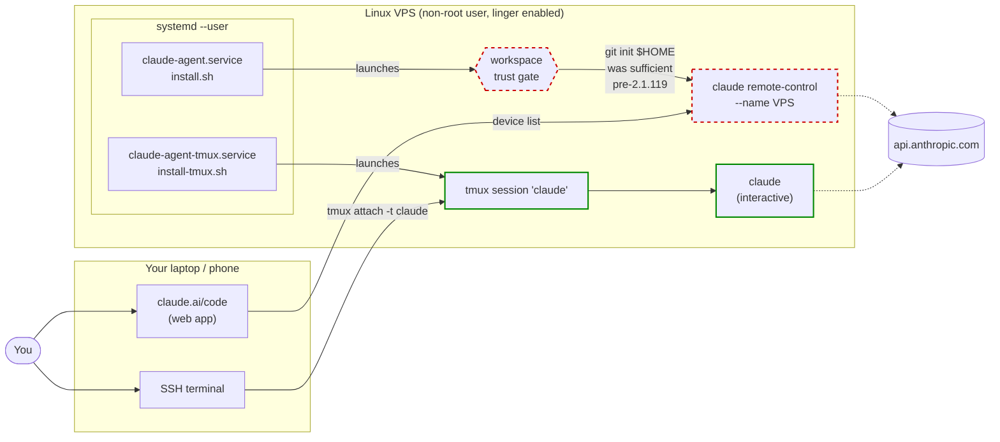

# claude-agent-kit

Install Claude Code as a **systemd user service** on a Linux VPS. Survives SSH logout, terminal close, and reboot. Attach from anywhere via <https://claude.ai/code> or the Claude app.

> ## ⚠ Known issue (2026-04-26): broken on Claude Code 2.1.119
>
> The kit's promised UX — unattended `claude remote-control` reachable via `claude.ai/code` — does **not** work on a fresh deployment with current CLI versions. After the flag-form fix described in `CHANGELOG.md`, the **workspace-trust gate** still blocks the systemd unit from completing boot, and the `git init $HOME` workaround documented in `DECISIONS.md` is no longer sufficient. A Fasthosts deployment on 2026-04-24 reproduced this; the tmux fallback below is the working alternative until upstream ships an unattended-trust path.
>
> If you want a persistent `claude` you can SSH into (terminal, not web), see [Tmux fallback](#tmux-fallback) — `./install-tmux.sh` packages it. If you want the `claude.ai/code` web UX specifically, the answer today is "wait for an Anthropic fix" — track [anthropics/claude-code#53606](https://github.com/anthropics/claude-code/issues/53606) and re-test when an unattended-trust path lands. Full reproduction in [`INCIDENTS/2026-04-24-workspace-trust.md`](INCIDENTS/2026-04-24-workspace-trust.md).

Tested against Claude Code **2.1.119+** (subcommand-style CLI). Handles every gotcha we hit deploying this in production — see the comments in `install.sh` for the full reasoning.

> **CPMAI phase:** IV — Model Development, **paused at the workspace-trust blocker**. The install path is implemented and tested manually on Ubuntu 22.04 + 24.04 VPSes; the kit installs cleanly but the running service can't pass workspace trust unattended on CLI 2.1.119. Phase V gates (automated test suite, golden-set bootstrap test) deferred until the upstream blocker resolves; tracked in `STATE.md`.

**Read these before installing on a real box:**
- [`THREAT_MODEL.md`](THREAT_MODEL.md) — trust boundary, assumptions, in-scope risks, known gaps.
- [`SECURITY.md`](SECURITY.md) — vulnerability disclosure process.
- [`DECISIONS.md`](DECISIONS.md) — why the kit makes the choices it does.
- [`INCIDENTS/`](INCIDENTS/) — post-mortems and upstream issues (Apr 2026 workspace-trust blocker).

## How it works

The kit ships **two install paths** for the same underlying problem ("persistent `claude` on a remote VPS"). They differ in *how you reach the agent* — and on CLI 2.1.119+ only the second one currently works end-to-end.



**Red dashed = currently broken on CLI 2.1.119+.** The `git init $HOME` workaround is no longer reliably sufficient for the workspace-trust gate under the systemd unit — see [anthropics/claude-code#53606](https://github.com/anthropics/claude-code/issues/53606). Until upstream lands an unattended-trust path, the supervised path can't reach `claude.ai/code`.

**Green = currently working on CLI 2.1.119+.** The tmux fallback runs `claude` interactively inside a `tmux` session that survives SSH logout and reboot. You attach over SSH, not via the web app.

## What it sets up

- A `claude-agent.service` systemd unit under `~/.config/systemd/user/`.
- `loginctl` linger so the service starts at boot without a login session.
- Workspace trust (via `git init $HOME`) so the service doesn't trip the trust dialog.
- Auto-restart on failure.

## Prerequisites

1. **A non-root user.** Claude Code ≥ 2.1.119 refuses bypass-permissions mode as root. Create one on a fresh VPS:
   ```sh
   adduser --disabled-password --gecos "" claude
   # Optional: give sudo (not required for the agent itself)
   usermod -aG sudo claude
   ```
2. **Claude Code CLI** installed on PATH. See <https://docs.claude.com/en/docs/claude-code/setup>.
3. **A Claude account** with Remote Control available on your plan. The installer will prompt for login and one-time consent.

## Install

From a shell logged in as the non-root user:

```sh
cd ~/claude-agent-kit
./install.sh
```

Optional: override the session name (defaults to the box's short hostname):

```sh
CLAUDE_SESSION_NAME=my-vps ./install.sh
```

The installer walks you through two interactive prompts:

- **`claude auth login`** — opens a web flow (or device code) to authenticate this user with your Claude account. Skipped if already logged in.
- **`claude remote-control`** consent — first time on an account, Claude asks "Enable Remote Control? (y/n)" and "spawn mode [1/2]". Answer `y` then `1`, then Ctrl-C to exit. Consent persists — subsequent runs (including the systemd launch) skip these prompts.

After those, the installer writes the unit, drops a runtime safety
`CLAUDE.md` at `$HOME` (skipped if you already have one — see Safety
below), and brings the service up.

## Safety

The installer ships a `CLAUDE.md.template` and writes it to `$HOME/CLAUDE.md`
on first run. The agent reads `$HOME/CLAUDE.md` on every session start;
the template adds **hard rules** denying destructive operations on:

- `~/.ssh/**` — deleting `authorized_keys` locks SSH out.
- `/usr/local/bin/claude*`, `/usr/bin/claude*`, `~/.local/bin/claude*`
  — the CLI binary.
- `~/.claude/auth.json`, `~/.claude/settings.json`, `~/.claude/keychain*`
  — auth and settings the agent needs to start.
- `/etc/systemd/system/claude-agent.service`,
  `~/.config/systemd/user/claude-agent.service` — the unit.

This is a runtime guard against a common failure mode: a "tidy up" or
"free disk" request that has the agent delete paths it depends on for
its own survival. The denylist is advisory to the agent (read every
session, enforced by the agent's behaviour). Defence-in-depth via
`~/.claude/settings.json`'s `permissions.deny` list is the recommended
next layer.

If you already have a `$HOME/CLAUDE.md`, the installer leaves it alone
and reminds you to merge in the rules from `CLAUDE.md.template`.

## Copying the kit to a new VPS

The simplest approaches:

```sh
# Option A — scp directly between your boxes (if SSH is configured both ways)
scp -r user@source-host:~/claude-agent-kit/ ~/

# Option B — via your laptop
scp -r user@source-host:~/claude-agent-kit/ /tmp/
scp -r /tmp/claude-agent-kit/ user@new-vps:~/

# Option C — paste the three files (README, template, install.sh) as heredocs
#           directly on the new box. See the end of this file.
```

## Bootstrapping a totally fresh Ubuntu VPS

From the root shell of a new VPS:

```sh
# 1. Create the non-root user
adduser --disabled-password --gecos "" claude
loginctl enable-linger claude

# 2. Install Claude Code (per your preferred method — example:)
# curl -fsSL https://claude.ai/install.sh | sh      # or whatever
# Make the binary available on PATH for the 'claude' user.

# 3. Drop the kit into the new user's home
mkdir -p /home/claude/claude-agent-kit
cp -r /path/to/kit/* /home/claude/claude-agent-kit/
chown -R claude:claude /home/claude/claude-agent-kit

# 4. Switch into that user's shell (machinectl preserves the user systemd bus)
machinectl shell claude@
# ...or: sudo -u claude -i

# 5. Run the installer
cd ~/claude-agent-kit && ./install.sh
```

## Verify

```sh
systemctl --user status claude-agent
journalctl --user -u claude-agent -f
```

From another box (or your phone): <https://claude.ai/code> → you should see the environment listed.

## Day-to-day use

- SSH in and out freely — the service stays up.
- `systemctl --user restart claude-agent` if it ever gets wedged.
- Update Claude Code on the host (`curl … | sh` or package manager), then `systemctl --user restart claude-agent`.

## Update the running service

Rerunning `./install.sh` overwrites the unit, reloads, and restarts cleanly. Prerequisite checks short-circuit if already done.

## Uninstall

```sh
systemctl --user disable --now claude-agent
rm ~/.config/systemd/user/claude-agent.service
# Optional (only if you don't use other user services):
sudo loginctl disable-linger "$USER"
```

## Troubleshooting

- **Service is in a restart loop (`Restart counter is at NN`, NN climbing)** — almost always means the unit's `ExecStart` is calling the CLI with a removed flag. The classic symptom from the 2026-04-24 incident is:
  ```
  Error: Input must be provided either through stdin or as a prompt argument when using --print
  claude-agent.service: Failed with result 'exit-code'
  claude-agent.service: Scheduled restart job, restart counter is at 53.
  ```
  Verify your unit's `ExecStart` matches the v2.1.119+ subcommand form:
  ```
  ExecStart=/usr/local/bin/claude remote-control --name <NAME> --permission-mode bypassPermissions
  ```
  The pre-v2.1.119 form `claude --remote-control <name> --persist` was removed (sessions persist by default; `--persist` no longer exists). Re-run `./install.sh` to refresh the unit if you're on an older clone of the kit. Confirm the running CLI version with `claude --version` — must be **2.1.119 or newer**.

- **`Address already in use` / unit fails to start, but no port is involved** — a manually-launched `claude remote-control --name <NAME>` may already hold the session name. Find it with `pgrep -af "remote-control.*<NAME>"` and either kill it or stop the conflicting unit, then `systemctl --user start claude-agent`.

- **"Failed to connect to bus: No medium found"** when running `systemctl --user` after `su -` — the session doesn't have a dbus. Fix:
  ```sh
  export XDG_RUNTIME_DIR=/run/user/$(id -u)
  ```
  Or always switch users with `machinectl shell user@` instead of `su -`.

- **"Workspace not trusted"** in the journal — the installer runs `git init` in `$HOME`, which historically auto-trusted the directory. **As of CLI 2.1.119, this is no longer reliably sufficient on first run** under the systemd unit (see the Known Issue at the top of this README). Verify `$HOME/.git` exists and that Claude's runtime user matches the unit's `WorkingDirectory`. If the dialog still blocks, you've hit the upstream blocker — the **Tmux fallback** below is the working alternative for now.

- **"cannot be used with root/sudo privileges"** — you're running as root. Create a non-root user (see Prerequisites).

- **"Enable Remote Control? (y/n)" in the journal** — the interactive consent wasn't completed. Rerun `./install.sh` and answer the prompt when it comes up, or run `claude remote-control --name <NAME> --permission-mode bypassPermissions` manually and answer `y`.

- **"Remote Control eligibility"** — your Claude plan may not include Remote Control. Check plan, or fall back to running plain `claude` inside tmux/screen as an alternative persistence pattern (see [Tmux fallback](#tmux-fallback)).

## Tmux fallback

When the workspace-trust blocker (or any other `claude.ai/code`-specific failure) makes the supervised `remote-control` path unusable, you can still get a **persistent `claude` session reachable over SSH** by running it inside `tmux` as a long-lived user service. This is *not* the same product — you reach it via `ssh box -t tmux attach`, not via `claude.ai/code` — but it survives SSH disconnect and reboot, which is the underlying ask in most cases.

| Feature | tmux + claude (this fallback) | claude-agent-kit (the supervised path) |
|---|---|---|
| How you reach it | `ssh box -t tmux attach` (terminal) | `claude.ai/code` web app or mobile |
| Multi-device | One terminal at a time | Yes (browser on any device) |
| Survives box reboot (with the systemd unit) | Yes | Yes (when the trust gate clears) |
| Available today on CLI 2.1.119 | Yes | **No** — workspace-trust gate blocks it |
| Appears in the `claude.ai/code` device list | No | Yes |

### Install (packaged)

The kit ships an installer for this fallback path:

```sh
cd ~/claude-agent-kit
./install-tmux.sh
```

What it does:

1. Refuses to run as root (same constraint as the supervised path).
2. Installs `tmux` via `apt` if not already present.
3. Enables `loginctl` linger so the unit starts at boot.
4. Walks you through `claude auth login` and one interactive `claude` launch (so any first-run trust prompt is cleared while a human is at the keyboard).
5. Drops a `claude-agent-tmux.service` user unit at `~/.config/systemd/user/` and starts it.

Override the tmux session name with `CLAUDE_SESSION_NAME=foo ./install-tmux.sh` (defaults to `claude`).

After it succeeds:

```sh
# Locally on the box:
tmux attach -t claude

# From another box / your laptop:
ssh -t user@box tmux attach -t claude

# Detach: Ctrl-b then d. Session keeps running.
```

### Manual setup (if you don't want to run the script)

```sh
sudo apt-get install -y tmux                    # if not already present
loginctl enable-linger "$USER"                  # survive logout
tmux new -s claude -d 'claude --permission-mode bypassPermissions'
ssh -t user@box tmux attach -t claude           # attach from another box
```

This gives you the same persistent session but without the systemd unit, so it won't auto-recover after `tmux kill-session` or a reboot.

## Sunset criteria

Archive this kit if any of these become true:

- Anthropic ships a first-party "remote-control as a service" deployment
  story that covers the same gotchas (auth, workspace trust, linger,
  unattended boot).
- Claude Code drops the `remote-control` subcommand or replaces the
  systemd-friendly invocation pattern in a way that can't be patched
  with a one-line install.sh change.
- The threat model becomes untenable for the configurations users
  actually run (e.g. multi-tenant becomes the default, requiring a
  rewrite rather than a kit update).

## Manual three-file install (paste into new VPS)

If scp isn't available, paste these three blocks on the target box as the non-root user:

```sh
mkdir -p ~/claude-agent-kit && cd ~/claude-agent-kit
```

Then paste the contents of `claude-agent.service.template` and `install.sh` from this kit into files of those names (`cat > filename <<'EOF'` … `EOF`), `chmod +x install.sh`, and `./install.sh`.
